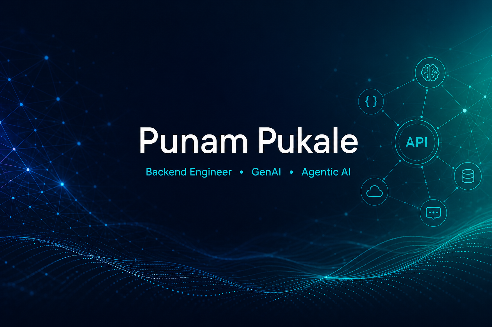
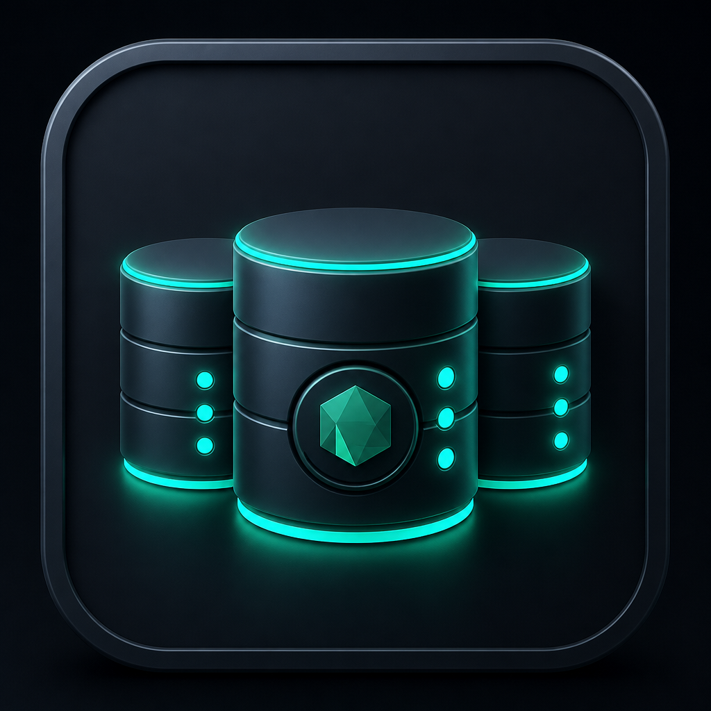
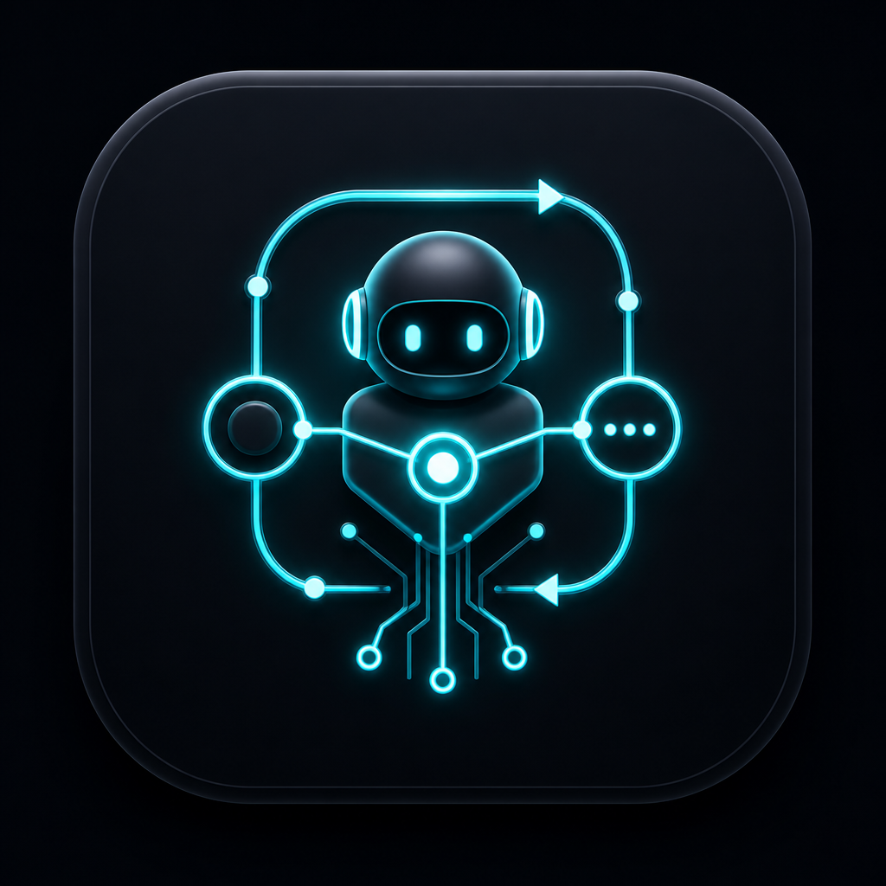

  

 

# Hi, I'm Punam Pukale

**Full Stack + Backend Engineer · GenAI / LLM · Agentic AI**

  
  
  
  
  

---

  
  &nbsp;&nbsp;&nbsp;
  

 

I build **full stack** products with a strong **backend** core: **React** on the frontend, **Node.js + Express** APIs, plus Python/FastAPI and Java/Spring Boot. On the AI side I build **agent harnesses**, **agent loops**, and **multi-model agentic systems**.

**Open to:** Full Stack Engineer · Backend Engineer · Software Engineer – Backend · GenAI Engineer · AI Platform Engineer · Agentic AI Engineer

---

  

 

<table>
  <tr>
    <td align="center" width="50%" valign="top">
      <h3>🏆 First Prize — 2025 Global AI Hackathon</h3>
      
Awarded with team <b>Kushal Sri Rangam, Shounak Palnitkar, Jinzhu Gao, Dongbin Lee</b>.

      

        
      

    </td>
    <td align="center" width="50%" valign="top">
      <h3>📄 IEEE Publication — COINS 2025</h3>
      
<b>Smart Hat 2.0:</b> An Energy-Aware Wearable Navigation System for Visually Impaired.

      

        
      

    </td>
  </tr>
</table>

---

  

 

### Full Stack

  
  
  
  
  

<table>
  <tr>
    <td align="center" width="90"> <b>React</b></td>
    <td align="center" width="90"> <b>TypeScript</b></td>
    <td align="center" width="90"> <b>JavaScript</b></td>
    <td align="center" width="90"> <b>Vite</b></td>
    <td align="center" width="90"> <b>Tailwind</b></td>
    <td align="center" width="90"> <b>Redux</b></td>
  </tr>
</table>

### Backend

  
  
  
  
  
  
  
  
  

<table>
  <tr>
    <td align="center" width="90"> <b>Node.js</b></td>
    <td align="center" width="90"> <b>Express</b></td>
    <td align="center" width="90"> <b>TypeScript</b></td>
    <td align="center" width="90"> <b>JavaScript</b></td>
    <td align="center" width="90"> <b>Python</b></td>
    <td align="center" width="90"> <b>FastAPI</b></td>
    <td align="center" width="90"> <b>Java</b></td>
    <td align="center" width="90"> <b>Spring</b></td>
  </tr>
</table>

### Data

  
  
  
  
  

<table>
  <tr>
    <td align="center" width="90"> <b>PostgreSQL</b></td>
    <td align="center" width="90"> <b>MySQL</b></td>
    <td align="center" width="90"> <b>Redis</b></td>
    <td align="center" width="90"> <b>Prisma</b></td>
    <td align="center" width="90"> <b>Neo4j</b></td>
  </tr>
</table>

### AI / GenAI

  
  
  
  
  
  
  
  
  
  
  

<table>
  <tr>
    <td align="center" width="90"> <b>OpenAI</b></td>
    <td align="center" width="90"> <b>Vertex AI</b></td>
    <td align="center" width="90"> <b>PyTorch</b></td>
    <td align="center" width="90"> <b>Playwright</b></td>
    <td align="center" width="90"> <b>Jira</b></td>
    <td align="center" width="90"> <b>GitHub</b></td>
  </tr>
</table>

### Cloud / infrastructure

  
  
  
  

<table>
  <tr>
    <td align="center" width="90"> <b>AWS</b></td>
    <td align="center" width="90"> <b>Docker</b></td>
    <td align="center" width="90"> <b>Actions</b></td>
    <td align="center" width="90"> <b>Prometheus</b></td>
    <td align="center" width="90"> <b>Grafana</b></td>
  </tr>
</table>

---

  

 

<table>
  <tr>
    <td width="50%" valign="top">
      <h3>🤖 <a href="https://github.com/PUNAMRAMPUKALE/autonomous-software-agent">autonomous-software-agent</a></h3>
      
<b>Agent harness · loops · multi-model</b>

      
Delivery loop: Jira → retrieve context → patch → review/test → PR → Slack. One LLM layer across OpenAI, Claude, Gemini, Ollama.

      

        
        
        
      

    </td>
    <td width="50%" valign="top">
      <h3>📚 <a href="https://github.com/PUNAMRAMPUKALE/ng12-clinical-agent">ng12-clinical-agent</a></h3>
      
<b>RAG · FastAPI · LangGraph</b>

      
Shared ChromaDB + Vertex AI RAG for decision support and chat, with citations and refusal when evidence is missing.

      

        
        
        
      

    </td>
  </tr>
  <tr>
    <td width="50%" valign="top">
      <h3>🖥️ <a href="https://github.com/PUNAMRAMPUKALE/AI-Layer">AI-Layer</a></h3>
      
<b>Computer-use loop · harness</b>

      
Observe → decide → act discovery, then deterministic replay with allowlists, guardrails, and human escalation.

      

        
        
        
      

    </td>
    <td width="50%" valign="top">
      <h3>💹 <a href="https://github.com/PUNAMRAMPUKALE/finai">finai</a></h3>
      
<b>AI platform · RAG + agents</b>

      
FastAPI ingestion/insights/recommend APIs with Weaviate, LangGraph, CrewAI, Neo4j, Postgres, Redis.

      

        
        
        
      

    </td>
  </tr>
  <tr>
    <td width="50%" valign="top">
      <h3>📊 <a href="https://github.com/PUNAMRAMPUKALE/llm-model-analyzer-backend-api">llm-model-analyzer-backend-api</a></h3>
      
<b>Node.js + Express backend</b>

      
Express + Prisma + PostgreSQL experiment API, Groq runs, local metrics, SSE streaming.

      

        
        
        
      

    </td>
    <td width="50%" valign="top">
      <h3>☕ <a href="https://github.com/PUNAMRAMPUKALE/REST_API">REST_API</a></h3>
      
<b>Java Spring Boot backend</b>

      
Cloud-vendor REST API with Spring Boot, Hibernate, and MySQL.

      

        
        
        
      

    </td>
  </tr>
</table>

---

  
    
  
  

---

## Let's connect

Open to Backend, GenAI, AI Platform, and Agentic AI roles · California, USA

